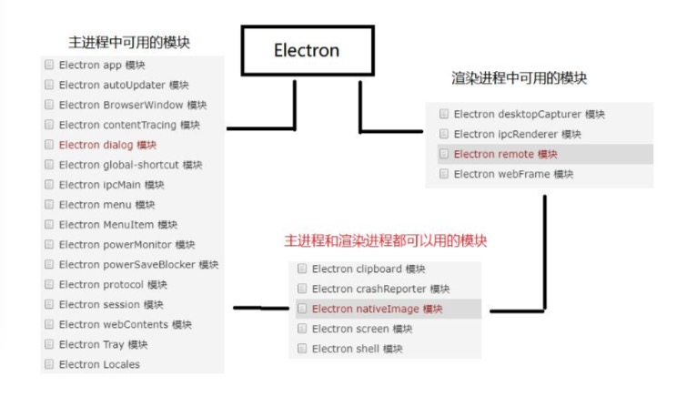

# electron 简介
	Electron是一个跨平台的桌面应用开发框架，用html css js的技术开发桌面上面可以安装的软件，可以让我们前端人员用html css js的技术开发跨平台可以安装的桌面软件。
### 为什么学习electron
1. 有开发桌面应用的需求
2. 开发成本地，学习成功低
3. 和vue angular很好的结合
4. 学习人数多 （在github的star 7w）


### 基于 Nodejs 的主流桌面应用开发框 Electron
 原理：通过浏览器和node.js合并到同一个运行环境中将其打包为mac  windows  和linux系统下的应用来实现这一目的 

# 安装electron
需要全局安装
```
cnpm install -g electron 
```
# 三种安装方式
(1) 克隆仓库
```
克隆示例项目的仓库
git clone https://github.com/electron/electron-quick-start

进入这个仓库
cd electron-quick-start

安装依赖
npm install

运行
npm start 或者 electron.
```
 (2) 通过脚手架 electron-forge 搭建一个 electron 项目 
 ```
 全局安装 forge(fochi)
 npm install -g electron-forge 
 
 创建文件和文件夹
 electron-forge init my-new-app

 (容易报错，删除依赖包node_modules)
 yarn install
 
 进入文件夹
cd my-new-app

执行
npm start
 ```
 (3) 手动创建项目
* 1、新建一个项目目录 例如:electrondemo01
* 2、在 electrondemo01 目录下面新建两个文件: index.html、main.js  
* 3、npm init --yes 生成 package.json
* 4、index.html 里面用 css 进行布局
* 5、在 main.js 中写如下代码:
```
 //主进程，操作外壳的
 //引入 electron模块
 var electron = require('electron');

 //创建引用
 const app = electron.app;
 let path = require('path')

 //控制窗口的模块
 const BrowserWindow = electron.BrowserWindow;

 //变量保存 对变量窗口的引用
 let mainWindow = null;

 //打开窗口
 app.on('ready', function() {
    //创建实例 设置宽高
    mainWindow = new BrowserWindow({ width: 800, height: 600 });

    //把index.html加载窗口
    mainWindow.loadFile('index.html');

    //通过路径加载index.html
    // mainWindow.loadURL(path.join('file:', __dirname, "index.html"));

    //开启调试模式
    mainWindow.webContents.openDevTools();

    //关闭窗口 要把mainWindow 销毁
    mainWindow.on('closed', function() {
        mainWindow = null;
    })
 })


 //监听所有窗口关闭的事件
 app.on('window-all-closed', function() {
     if (process.platform !== 'darwin') {
         app.quit();
     }
 })
```
npm init 生成一个package.json 配置项目的元数据(文件夹不能是中文)
```
npm init --yes
```
main.js 配置主进程 
```
{
  "name": "electrondemo01",
  "version": "1.0.0",
  "description": "",
  "main": "main.js",
  "scripts": {
    "test": "echo \"Error: no test specified\" && exit 1"
  },
  "keywords": [],
  "author": "",
  "license": "ISC"
}
```
运行项目
```
electron .
```

# 主进程和渲染进程
主进程只有一个可以有多个渲染进程，每打开一个窗口就创建一个渲染进程，
```
package -> main.js -> index.html
```

 
# 渲染进程 读取本地文件
浏览器中的web页面是一个沙盒环境，不允许操作原声的资源，electron在node api的支持下可以操作页面操作系统
在index.html页面
```
var fs = require('fs');

var content = document.getElementById('content');
var button = document.getElementById('button'); 

button.addEventListener('click',function(e){
    fs.readFile('package.json','utf8',function(err,data){ content.textContent = data;
    console.log(data);
    }); 
});
```
# 模块


# remote 模块: 主进程和渲染进程通信

remote模块: 提供了一种在渲染进程(网页)和主进程之间进行进程间通讯(IPC)的简便途,渲染进程无法直接调用主进程的内容，
 
```
var btn = document.querySelector('#btn');
var path = require('path');

var BrowerWindow = require('electron').remote.BrowserWindow; 
btn.onclick = () => {
  win = new BrowerWindow({ 
    width: 300,
    height: 200,
    frame: false, // 隐藏菜单
    // fullscreen: true, //全屏展示
    // transparent: true // 背景透明
  })
  //新窗口页面 
  win.loadURL(path.join('file:',__dirname,'news.html'));
  //关闭
  win.on('close',()=>{win = null});
}
```

# Menu 模块 自定义菜单
```
// Menu 是主进程模块， 必须的用remote 通讯
var remote = require('electron').remote;

const Menu = remote.Menu;


//定义菜单
var template = [{

    label: '文件',
    submenu: [{
        label: '新建文件',
        accelerator: 'ctrl+n',
        click: function () {
          console.log('ctrl+n');
        }
      },
      {

        label: '新建窗口',
        click: function () {

          console.log('new window');
        }
      }
    ]
  },
  {

    label: '编辑',
    submenu: [

      {

        label: '复制11',
        role: 'copy'
      },
      {

        label: '截切',
        role: 'cut'
      }
    ]
  }


]
// 构建模板
var m = Menu.buildFromTemplate(template);

// 设置应用程序菜单
Menu.setApplicationMenu(m);
```

# 自定义右键菜单
```
window.addEventListener('contextmenu', function (e) {
  //阻止当前窗口默认事件
  e.preventDefault();

  //在当前窗口点击右键的时候弹出  定义的菜单模板
  m.popup({
    window: remote.getCurrentWindow()
  })
}, false)
```

# ipcMain 和 ipcRenderer 模块 主进程和渲染进程之间的通讯（同步和异步）
* 在渲染进程中通过一个事件去执行主进程里面的方法
* 或者在渲染进程中通知 主进程处理事件，

### ipcMain：当在主进程中使用时，它处理从渲染器进程（网页）发送出来的异步和同步信息, 当然也有可能从主进程向渲染进程发送消息。

### ipcRenderer： 使用它提供的一些方法从渲染进程 (web 页面) 发送同步或异步的消息到主 进程。 也可以接收主进程回复的消息


### 在main.js中引入
```
 require('./main/ipcMain.js');
```

# 场景1：渲染进程给主进程发送异步消息  
renderer/ipcRenderer.js
```
//渲染进程发送
const { ipcRenderer } = require('electron')

ipcRenderer.send('msg',{name:'123456789'}); //异步

```
main/ipcMain.js
```
//主进程接收
const { ipcMain } = require('electron');

ipcMain.on("msg",(event,arg) => {
  
})
```

# 场景 2：渲染进程给主进程发送异步消息，主进程接收到异步消息以后通知渲染进程

主进程接收到消息
```
const { ipcMain } = require('electron');
ipcMain.on("msg", (event, arg) => {
  console.log(event, arg);
  //接收后返回给渲染进程
  event.sender.send('reply', 'kong zhi tai'); 
})

```
渲染进程接收返回的消息
```
const { ipcRenderer } = require('electron')

ipcRenderer.on('reply', function(event, arg) { console.log(arg); })
```

# 过 BrowserWindow 和 webContents 模块实现渲染进 程和渲染进程的通信
localStorage 通讯
```
 //渲染进程和渲染进程的通讯 
  localStorage.setItem("keys",'123');

//news.接收
  var keys=  localStorage.getItem("keys");
  console.log(keys);
```

open.js  //发送
```
//渲染进程没法直接调用主进程中的模块，但是我们可以通过 electron中的remote模块间接的调用主进程中的模块
var path = require('path');
var BrowserWindow = require('electron').remote.BrowserWindow;

var win = null;

var btn3 = document.querySelector('#btn3');
btn3.onclick = () => {
  win = new BrowserWindow({
      width: 500,
      height: 500,
      frame: false,
  }, )
  win.webContents.openDevTools();
  win.loadURL(path.join('file:', __dirname, 'BrowserWindow.html'));

  //渲染进程和渲染进程通信,、监听当前窗口加载完成的事件
  win.webContents.on('did-finish-load', (event) => {
      win.webContents.send('toNews', '12345678')
  })

  win.on('close', () => {
      win = null
  });

  //(1)渲染进程和渲染进程的通讯
  localStorage.setItem("keys", '123');
}
```
news.html接收
```
var keys = localStorage.getItem("keys");
  console.log(keys);

  //接收主进程
  const {
      ipcRenderer
  } = require('electron')
  ipcRenderer.on('toNews', function(event, aid) {
      console.log(aid);
  })
```

# shell 模块提供了集成其他桌面客户端的关联功能.
shell 既输入主进程也属于 渲染进程
```

var {shell}=require('electron')

var aDom=document.querySelector('#adom');


aDom.onclick=function(e){
    

    // 阻止a标签的默认行为

    e.preventDefault();    

    var href=this.getAttribute('href');

    //sheel模块打开外部浏览器
    shell.openExternal(href)

}
```

# Webview
Webview 与 iframe 有点相似，但是与 iframe 不同, webview 和你的应用运行的是不同的进程。它不拥有渲染进程的权限，并且应用和嵌入内容之间的交互全部都是异步的。因为这能保证应用的安全性不受嵌入内容的影响。
```
<webview id="webview" src="https://www.itying.com" style="position:fixed; width:100%; height:100%">
</webview>
```
#  dialog 弹出框
```
var {
    remote
} = require('electron');


//https://electronjs.org/docs/api/dialog
var errorDom = document.querySelector('#error');

var mesageBoxDom = document.querySelector('#mesageBox');


var openDialogDom = document.querySelector('#openDialog');

var saveDialogDom = document.querySelector('#saveDialog');


//错误提示
errorDom.onclick = function() {
    remote.dialog.showErrorBox('警告', '操作有误');

}

//信息提示
mesageBoxDom.onclick = function() {
    remote.dialog.showMessageBox({
        type: 'info', //类型
        title: '提示信息',
        message: '内容',
        buttons: ['ok', 'no']

    }, function(index) {
        console.log(index) //索引
    })
}

//打开文件夹
openDialogDom.onclick = function() {
    remote.dialog.showOpenDialog({

        // properties: ['openDirectory'] //打开文件夹
        properties: ['openFile'] //打开文件
    }, function(data) {
        console.log(data);
        //["C:\Users\Administrator\Desktop\新建文件夹\js\index.js"]
    })
}

//保存类型
saveDialogDom.onclick = function() {
    remote.dialog.showSaveDialog({
        title: 'save file',
        defaultPath: "aaa.jpg", //保存内容
        filters: [{
                name: 'Images',
                extensions: ['jpg', 'png', 'gif']
            },
            {
                name: 'Movies',
                extensions: ['mkv', 'avi', 'mp4']
            },
            {
                name: 'Custom File Type',
                extensions: ['as']
            },
            {
                name: 'All Files',
                extensions: ['*']
            }
        ]

    }, function(path) {
        console.log(path);

        // C:\Users\Administrator\Desktop\新建文件夹\js\aaa.jpg
        //保存以后会打印保存的路径  , 但是不会实现真的保存功能  （具体保存什么数据可以写在nodejs里面）
    })
}
```
# Tray任务了栏图标
```
var { Tray } = require('electron');

var path = require('path');

//绑定图标
var iconTray = new Tray(path.join(__dirname, '../static/lover.png'));
console.log(iconTray);
```
# 任务栏图标右键
mac左键菜单
  ```
var trayMenu=Menu.buildFromTemplate([

    {

      label:'设置',
      click:function(){

        console.log('setting')
      }
    },
    {

        label:'升级',
        click:function(){
  
          console.log('update')
        }
      },
    {

        label:'退出',
        click:function(){
            if (process.platform !== 'darwin') {
                app.quit();
              }
        }
    }
]);
//设置右键菜单
iconTray.setContextMenu(trayMenu);
//鼠标划过icon提示功能
iconTray.setToolTip('electron应用');
  ```


  # 闪烁效果
```
var count = 0;

var timer = setInterval(function() {
    count++;

    if (count % 2 == 0) {

        iconTray.setImage(path.join(__dirname, '../static/lover.png'))

    } else {

        iconTray.setImage(path.join(__dirname, '../static/timg.jpg'))
    }

}, 500)
```
# 消息通知
```
var option2 = {
    title: 'electron 通知',
    body: 'electron跨平台软件开发教程更新了'
}

//h5弹窗
var myNotification = new window.Notification(option2.title, option2);

myNotification.onclick = function() {

    console.log('点击了');
}
```
# 检查网络
```
window.addEventListener('online', function() {
    console.log('有网络了');
})

window.addEventListener('offline', function() {
    console.log('无网络了');
})
```