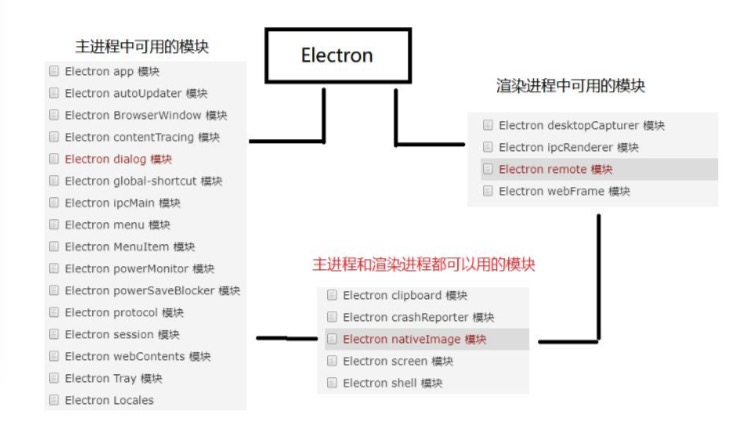

# electron (一来可搓)简介
	Electron是一个跨平台的桌面应用开发框架，用html css js的技术开发桌面上面可以安装的软件，可以让我们前端人员用html css js的技术开发跨平台可以安装的桌面软件。
### 为什么学习electron
1. 有开发桌面应用的需求
2. 开发成本地，学习成功低
3. 和vue angular很好的结合
4. 学习人数多 （在github的star 7w）


### 基于 Nodejs 的主流桌面应用开发框 Electron
 原理：通过浏览器和node.js合并到同一个运行环境中将其打包为mac  windows  和linux系统下的应用来实现这一目的 

# 安装electron
需要全局安装
```
cnpm install -g electron 
```
# 三种安装方式
(1) 克隆仓库
```
克隆示例项目的仓库
git clone https://github.com/electron/electron-quick-start

进入这个仓库
cd electron-quick-start

安装依赖
npm install

运行
npm start 或者 electron.
```
 (2) 通过脚手架 electron-forge 搭建一个 electron 项目 
 ```
 全局安装 forge(fochi)
 npm install -g electron-forge 
 
 创建文件和文件夹
 electron-forge init my-new-app

 (容易报错，删除依赖包node_modules)
 yarn install
 
 进入文件夹
cd my-new-app

执行
npm start
 ```
 (3) 手动创建项目
* 1、新建一个项目目录 例如:electrondemo01
* 2、在 electrondemo01 目录下面新建两个文件: index.html、main.js  
* 3、npm init --yes 生成 package.json
* 4、index.html 里面用 css 进行布局
* 5、在 main.js 中写如下代码:
```
 //主进程，操作外壳的
 //引入 electron模块
 var electron = require('electron');

 //创建引用
 const app = electron.app;
 let path = require('path')

 //控制窗口的引用  布瓦泽window
 const BrowserWindow = electron.BrowserWindow;

 //变量保存 对变量窗口的引用
 let mainWindow = null;

 //打开窗口
 app.on('ready', function() {
    //创建实例 设置宽高
    mainWindow = new BrowserWindow({ width: 800, height: 600 });

    //把index.html加载窗口
    mainWindow.loadFile('index.html');

    //通过路径加载index.html
    // mainWindow.loadURL(path.join('file:', __dirname, "index.html"));

    //开启调试模式
    mainWindow.webContents.openDevTools();

    //关闭窗口 要把mainWindow 销毁
    mainWindow.on('closed', function() {
        mainWindow = null;
    })
 })


 //监听所有窗口关闭的事件
 app.on('window-all-closed', function() {
     if (process.platform !== 'darwin') {
         app.quit();
     }
 })
```
npm init 生成一个package.json 配置项目的元数据(文件夹不能是中文)
```
npm init --yes
```
main.js 配置主进程 
```
{
  "name": "electrondemo01",
  "version": "1.0.0",
  "description": "",
  "main": "main.js",
  "scripts": {
    "test": "echo \"Error: no test specified\" && exit 1"
  },
  "keywords": [],
  "author": "",
  "license": "ISC"
}
```
运行项目
```
electron .
```

# 主进程和渲染进程
主进程只有一个可以有多个渲染进程，每打开一个窗口就创建一个渲染进程，
```
package -> main.js -> index.html
```

 
# 渲染进程 读取本地文件
浏览器中的web页面是一个沙盒环境，不允许操作原声的资源，electron在node api的支持下可以操作页面操作系统
在index.html页面
```
var fs = require('fs');

var content = document.getElementById('content');
var button = document.getElementById('button'); 

button.addEventListener('click',function(e){
    fs.readFile('package.json','utf8',function(err,data){ content.textContent = data;
    console.log(data);
    }); 
});
```
# 模块

渲染进程无法直接调用主进程的内容，
remote 模块提供了一种在渲染进程(网页)和主进程之间进行进程间通讯(IPC)的简便途
 
```
const btn = document.querySelector('#btn');
const path = require('path');
const BrowerWindow = require('electron').remote.BrowserWindow; btn.onclick = () => {
win = new BrowerWindow({ width: 300,
height: 200, frame: false, transparent: true // fullscreen:true
}) win.loadURL(path.join('file:',__dirname,'news.html')); win.on('close',()=>{win = null});
}
```